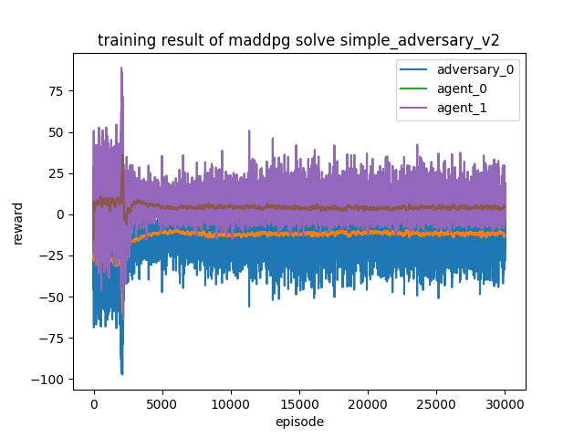
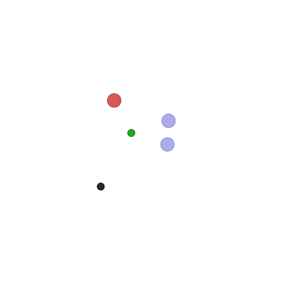
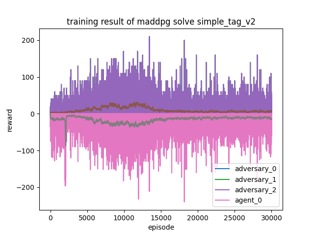
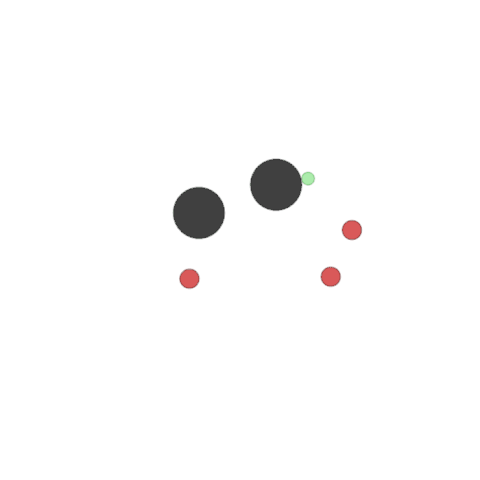

# maddpg with PyTorch and PettingZoo

The original version of [MADDPG](https://arxiv.org/pdf/1706.02275.pdf)
use environment of  [multiagent-particle-envs](https://github.com/openai/multiagent-particle-envs),
which has no longer been updated.
A maintained version of these environments is provided
by [PettingZoo](https://github.com/Farama-Foundation/PettingZoo).
So this repository implement MADDPG using PyTorch and PettingZoo

# Usage

training and evaluation is simple and straightforward, take `simple_tag` for example:

```shell
python main.py simple_tag_v2  # training
python evaluate.py simple_tag_v2 1  # evaluate result saved in folder 1
```

more details about arguments can be found in `main.py`, `evaluate.py`
or simply run `python main.py --help`, `python evaluate.py --help`

# Result

|  environment name   | training result                                      | evaluation result                                    |
|  ----  |------------------------------------------------------|------------------------------------------------------|
| simple_adversary  |  |  | 
| simple_tag  |              |              | 

# reference

- implementation of [openai](https://github.com/openai/maddpg)
- implementation of [shariqiqbal2810](https://github.com/openai/maddpg)
- [maddpg-mpe-pytorch](https://github.com/Git-123-Hub/maddpg-mpe-pytorch)